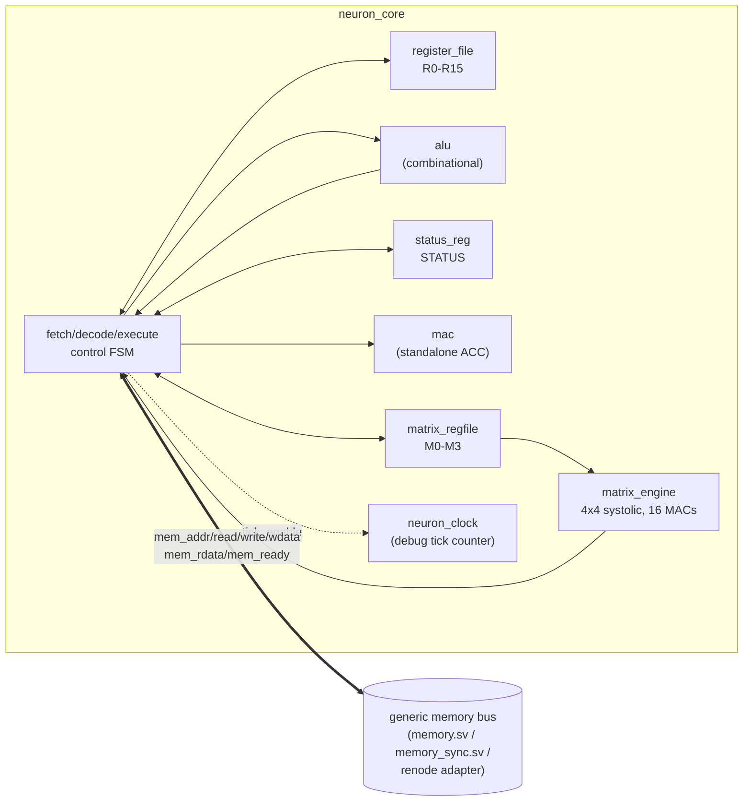
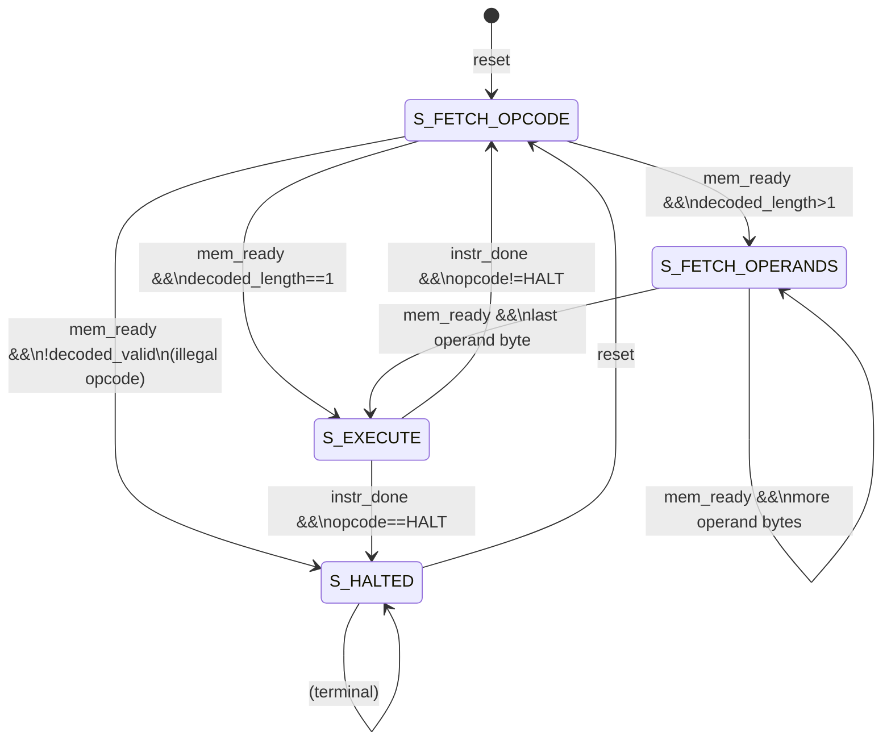

# Neuron32 microarchitecture

This documents the actual hardware in `rtl/`, as implemented today — not
a roadmap. See `docs/ISA.md` for instruction semantics and
`docs/MEMORY_INTERFACE.md` for the memory bus contract this all rests on.

## Overview

Neuron32 is a **non-pipelined, multi-cycle, byte-at-a-time-fetch**
control unit (`rtl/neuron_core.sv`) wired directly to its functional
units. It deliberately mirrors the structure of Nemu's reference
`step()` function opcode-by-opcode rather than a pipelined design, since
the software reference model itself has no notion of pipelining — this
keeps the two easy to cross-check (`scripts/diff_test.sh`) and is a
conscious simplicity choice for an early-stage design, not an oversight.

## Control FSM

Four states (`rtl/neuron_core.sv`'s `state_e`):

- **`S_FETCH_OPCODE`** — presents `mem_addr = pc`, `mem_read = 1`. On
  `mem_ready`, latches the opcode byte, advances `pc`, and looks it up in
  `rtl/decode.sv` (fed straight from `mem_rdata` the same cycle, so the
  instruction's length is known immediately). An unrecognized opcode
  (`decoded_valid == 0`) goes straight to `S_HALTED` with
  `illegal_opcode` set — see `docs/EXCEPTIONS_AND_UNDEFINED_BEHAVIOR.md`.
  A 1-byte instruction (`RET`, `MACCLR`, `HALT`) skips operand fetch
  entirely.
- **`S_FETCH_OPERANDS`** — one byte per cycle into `operand[0..4]`, same
  `mem_ready`-gated protocol, until `decoded_length - 1` operand bytes
  have been captured.
- **`S_EXECUTE`** — a single large combinational `case (opcode_reg)`
  computes everything about this instruction: register/ALU/MAC/matrix
  operands, the result, flag updates, and `instr_done`. Memory-touching
  opcodes (`LOAD`/`STORE`/`PUSH`/`POP`/`CALL`/`RET`) hold `instr_done` at
  `0` until `mem_ready`; everything else sets it the same cycle it
  enters `S_EXECUTE`. See "Instruction timing" below for exactly how long
  each opcode class spends here.
- **`S_HALTED`** — terminal until `reset` (see `docs/RESET.md`).

## Functional units

- **`register_file`** (`rtl/register.sv`) — 16x32-bit, two combinational
  read ports, one synchronous write port. Resets every register to `0`.
- **`alu`** (`rtl/alu.sv`) — purely combinational, single-cycle. Computes
  `result`/`zero`/`negative`/`carry`/`overflow` for one operation
  per cycle from `isa_pkg`'s shared `ALU_*` opcodes (imported, not
  redeclared — a prior version of this file kept a local copy of these
  constants, which the lint pass in this hardening cycle replaced with a
  shared import specifically to remove the risk of the two silently
  drifting apart).
- **`status_reg`** (`rtl/status_reg.sv`) — one register, updated
  synchronously under one of five `flag_mode` patterns
  (`isa_pkg::flag_mode_e`) selected per-opcode by `neuron_core`'s
  combinational block; see `docs/ISA.md` for which opcodes use which
  mode.
- **`mac`** (`rtl/mac.sv`) — one standalone signed-INT8x8->32
  multiply-accumulate unit backing the `MAC`/`MACCLR`/`MACREAD`
  instructions. Purely a 32-bit register plus an adder/multiplier;
  `clear` and `reset` both zero it.
- **`matrix_regfile`** (`rtl/matrix_regfile.sv`) — 4 registers x 4x4
  32-bit signed cells, two independent combinational read ports (for
  `MMUL`'s two source operands) and two write paths: a single-cell
  synchronous write (`MSET`) and a synchronous bulk 4x4 write (`MMUL`'s
  result write-back).
- **`matrix_engine`** (`rtl/matrix_engine.sv`) — 16 `mac` instances
  wired in a 4x4 grid (`generate`), one per output cell, all stepped in
  parallel each cycle against a shared `k` counter — see "MMUL timing"
  below.
- **`neuron_clock`** (`rtl/clock.sv`) — a free-running cycle counter,
  debug/perf visibility only (`ticks_dbg`). Plays no role in
  instruction correctness; matches Nemu's own tick counter
  (`src/clock.rs`) for parity when comparing cycle counts, not for
  anything architectural.

## Instruction timing

With zero-wait-state memory (`memory.sv`, or `memory_sync.sv` with
`wait_states=0`), every fetch cycle and every memory-touching execute
cycle completes in exactly 1 cycle (`mem_ready` is combinationally `1`).
Total cycles per instruction:

| Class | Cycles | Notes |
|---|---|---|
| Register-only (`MOV`, `ADD`..`SHR`, `CMP`, `NOT`, `MAC`, `MACCLR`, `MACREAD`, `RELU`, `MSET`, `OUT`, `MOVI`) | `instruction length in bytes` (fetch) `+ 1` (execute) | `instr_done` combinational the same cycle `S_EXECUTE` is entered. |
| `JMP`/`JZ`/`JNZ` | `5 + 1` | Branch target applied the same `instr_done` cycle. |
| `CALL`/`RET` | `5 + 1` fetch/decode-execute, **plus however long the stack memory access takes** (1 cycle at zero wait states) | The push/pop and the branch happen on the same `instr_done` cycle. |
| `LOAD`/`STORE`/`PUSH`/`POP` | `instruction length + (1 + wait_states)` | `instr_done` waits on `mem_ready`; see `docs/MEMORY_INTERFACE.md`. |
| `HALT` | `1 + 1` | Goes straight to `S_HALTED`. |
| `MMUL` | `4 + 1` (fetch) `+ 6` (execute — see below) | |

Non-memory execute cycles are all `+1` because `instr_done` is
combinational the same cycle `S_EXECUTE` is entered — the `+1` accounts
for the one full clock period spent in that state before the FSM
transition back to `S_FETCH_OPCODE` is observed.

### MMUL timing

Traced directly from `rtl/matrix_engine.sv`'s FSM (`start`/`busy`/`k`):

1. **Cycle 1** (first cycle in `S_EXECUTE` for this instruction):
   `mmul_start = !mmul_busy && !mmul_done` pulses high (the matrix
   register reads for the two source tiles are combinational off this
   same cycle's `operand[]`-derived selectors).
2. **Cycles 2-5**: `busy = 1`; all 16 MAC units step once per cycle
   against `k = 0, 1, 2, 3` respectively (`a_tile[row][k] *
   b_tile[k][col]`, accumulated).
3. **Cycle 6**: `done` pulses for exactly one cycle (asserted the cycle
   after `k` reached `MATRIX_SIZE-1`); `neuron_core` samples it
   combinationally, bulk-writes the 4x4 result to the destination matrix
   register, updates the MMUL flag mode, and sets `instr_done`.

Six cycles total in `S_EXECUTE`, independent of memory latency (`MMUL`
never touches the memory bus). `rtl/matrix_engine.sv` carries two
assertions specifically guarding this protocol (`busy`/`done` mutual
exclusion, `done` never held two cycles running) — see
`tb/matrix_tb.sv` for the hardening tests exercising it directly
(zero/identity/signed-boundary tiles, back-to-back MMULs including one
issued the instant a prior `done` is observed, `start` held high across
an entire run, reset mid-run).

## Halt behavior

`HALT` and an illegal opcode both land in `S_HALTED`, which is terminal
— the FSM's `always_ff` has no transition out of `S_HALTED` except
`reset`. See `docs/RESET.md`.
